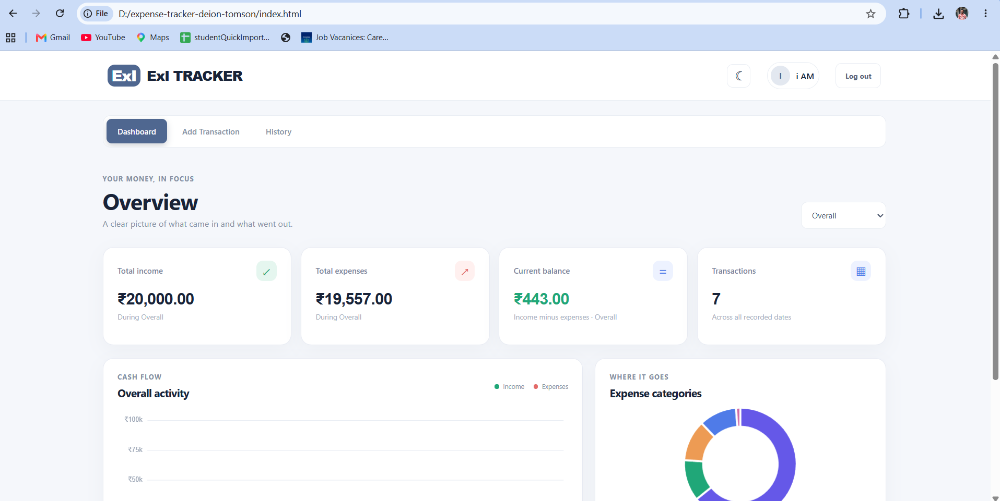
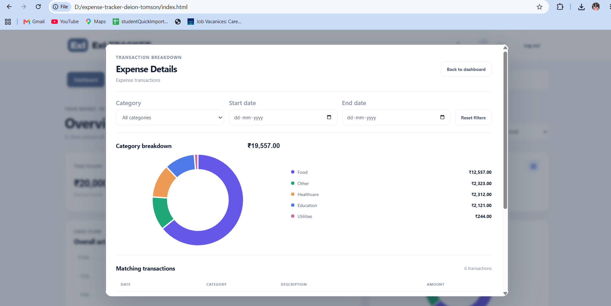
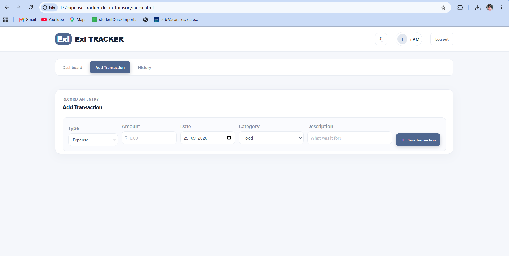
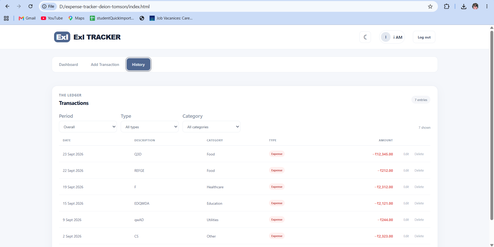
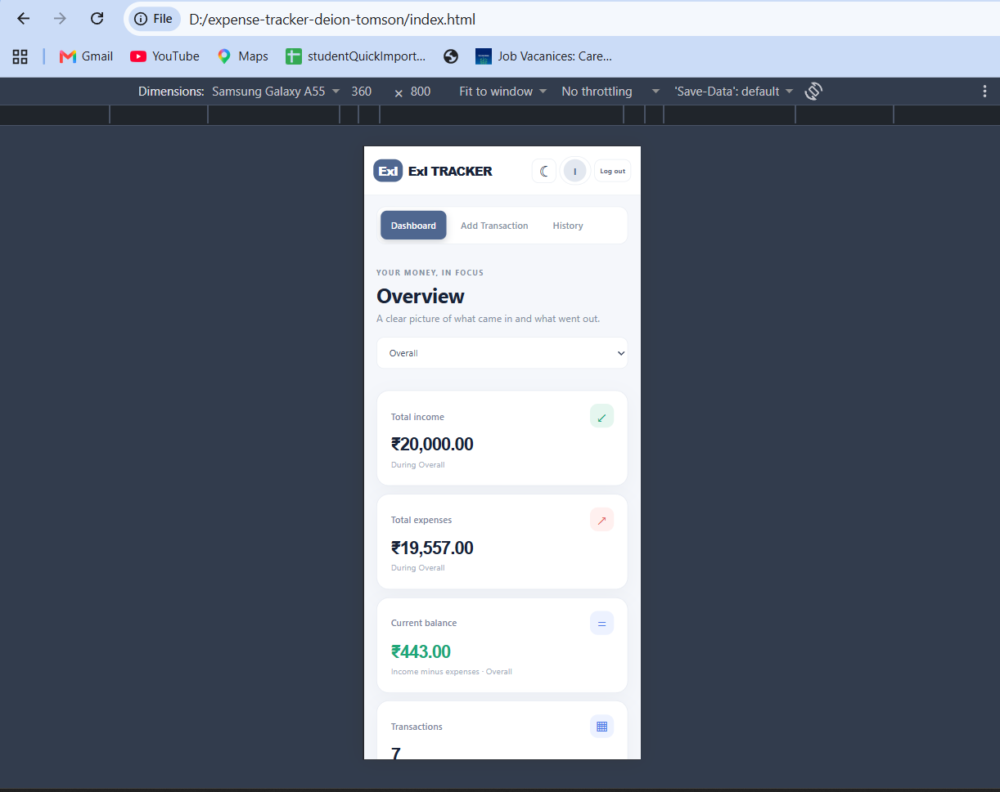

# ExI - Expense and Income Tracker

ExI is a browser-based **Expense and Income Tracker** designed to help users manage, monitor, and analyze their personal income and expenses through a simple, modern, and responsive interface.

The application is built using **HTML, CSS, and JavaScript**. It uses browser **Local Storage** to store account and transaction data locally, so no backend server or database is required.

---

##  How to Run the Application

### 1. Clone the Repository

Open **Command Prompt**, **PowerShell**, or **Git Bash** and run:

```bash
git clone https://github.com/dEIOnTomsoN/expense-tracker-deion-tomson.git
```

### 2. Open the Project Folder

After cloning, move into the project directory:

```bash
cd expense-tracker-deion-tomson
```

### 3. Run the Application

Locate the following file inside the project folder:

```text
index.html
```

Double-click **`index.html`** to open the application in your default web browser.

You can also right-click `index.html` and select:

**Open with → Google Chrome / Microsoft Edge / Firefox**

### 4. Start Using the Application

After opening the application:

1. Create a local account.
2. Log in to the application.
3. Open the dashboard.
4. Add income and expense transactions.
5. View your financial summary.
6. Analyze your income and expenses using the available charts and filters.

> **Note:** No build tools, package manager, or server are required. Chart.js is loaded from a CDN. Account and transaction data are stored locally in the browser using Local Storage and are not synchronized across devices.

---

#  Website Features

##  Account Management

* Create an account locally.
* Log in and log out of the application.
* Store account information using browser Local Storage.
* Keep account data available after refreshing the page.
* Provide validation for account-related inputs.
* Display helpful error messages for invalid login or signup information.

---

##  Income & Expense Management

Users can record and manage their financial transactions.

Features include:

* Add income transactions.
* Add expense transactions.
* Enter transaction amount.
* Select a transaction category.
* Select the transaction date.
* Add a transaction description.
* Edit existing transactions.
* Delete transactions.
* View recorded transactions.
* Automatically update financial totals when transactions are added, edited, or deleted.

---

##  Dashboard

The dashboard provides a detailed overview of the user's financial activity.

It displays important information such as:

* **Total Income**
* **Total Expenses**
* **Current Balance**
* Monthly income summary.
* Monthly expense summary.
* Income and expense trends.
* Category-wise expense information.
* Recent transaction information.

The dashboard allows users to quickly understand their current financial position and spending patterns.

---

##  Financial Analytics

ExI provides visual representations of financial information to make spending patterns easier to understand.

The application includes:

* Monthly income summaries.
* Monthly expense summaries.
* Income and expense trends.
* Category-wise expense charts.
* Visual comparison of income and expenses.
* Financial activity analysis.

Charts are implemented using **Chart.js**.

---

##  Transaction History & Filters

The application maintains a history of recorded transactions.

Users can:

* View previous transactions.
* Filter transactions by **Income**.
* Filter transactions by **Expense**.
* Filter transactions by **Category**.
* Filter transactions by **Date**.
* Quickly find specific transactions.
* Review transaction details.

---

##  Local Storage

ExI uses the browser's **Local Storage** to store account and transaction information.

This provides the following benefits:

* Data remains available after refreshing the page.
* No backend server is required.
* No database setup is required.
* The application can run directly in a browser.
* Transaction information is stored locally on the user's device.

> **Important:** Local Storage data is specific to the browser and device. The data is not synchronized between different devices or browsers.

---

##  Light & Dark Themes

ExI provides theme customization for a better user experience.

Features include:

* Light theme.
* Dark theme.
* Easy theme switching.
* Comfortable viewing in different lighting conditions.

---

##  Responsive Web Design

The application is designed to work across different screen sizes.

ExI supports:

*  Desktop screens
*  Laptop screens
*  Mobile devices
*  Tablet screens

The interface automatically adapts to different screen sizes to provide a consistent user experience.

---

##  Validation & Error Handling

The application includes input validation and helpful error messages.

Validation is provided for areas such as:

* Account creation.
* Login information.
* Transaction amounts.
* Transaction categories.
* Transaction dates.
* Required transaction details.

This helps prevent invalid or incomplete information from being stored.

---

#  Application Screenshots

## 1. Dashboard

The main dashboard provides an overview of the user's financial activity, including total income, total expenses, current balance, and financial summaries.



---

## 2. Income & Expense Details

The detailed income and expense view provides a complete breakdown of the user's financial activity, allowing users to understand their income and expenditure in greater detail.



---

## 3. Add Transactions

Users can add new income or expense transactions by entering the amount, category, date, and description.



---

## 4. Transaction History & Filters

The transaction history displays previously recorded transactions and provides filtering options based on transaction type, category, and date.



---

## 5. Responsive Web Design

ExI is designed to provide a responsive experience across desktop, tablet, and mobile screen sizes.



---

#  Technologies Used

| Technology        | Purpose                                    |
| ----------------- | ------------------------------------------ |
| **HTML5**         | Website structure                          |
| **CSS3**          | Styling and responsive design              |
| **JavaScript**    | Application logic and functionality        |
| **Chart.js**      | Charts and data visualization              |
| **Local Storage** | Local account and transaction data storage |

---

# 📂 Project Structure

```text
expense-tracker-deion-tomson/
│
├── index.html
├── login_signup.html
│
├── css/
│   └── ...
│
├── js/
│   └── ...
│
├── img/
│   ├── IM1.png
│   ├── IM2.png
│   ├── IM3.png
│   ├── IM4.png
│   └── IM5.png
│
└── README.md
```

> The exact folder and file structure may vary depending on the current version of the project.

---

# 🌐 GitHub Repository

**Repository:**

https://github.com/dEIOnTomsoN/expense-tracker-deion-tomson.git

---

# 📌 Important Notes

* ExI is a **client-side browser application**.
* No backend server is required.
* No database is required.
* Chart.js is loaded through a CDN.
* Account and transaction information is stored locally using browser Local Storage.
* Data remains available after refreshing the page.
* Local data is not synchronized between devices or browsers.
* Clearing browser Local Storage may permanently remove locally stored account and transaction data.

---

#  Project

## ExI - Expense and Income Tracker

A simple, modern, and responsive web application for **recording, monitoring, managing, and analyzing personal income and expenses**.

---
